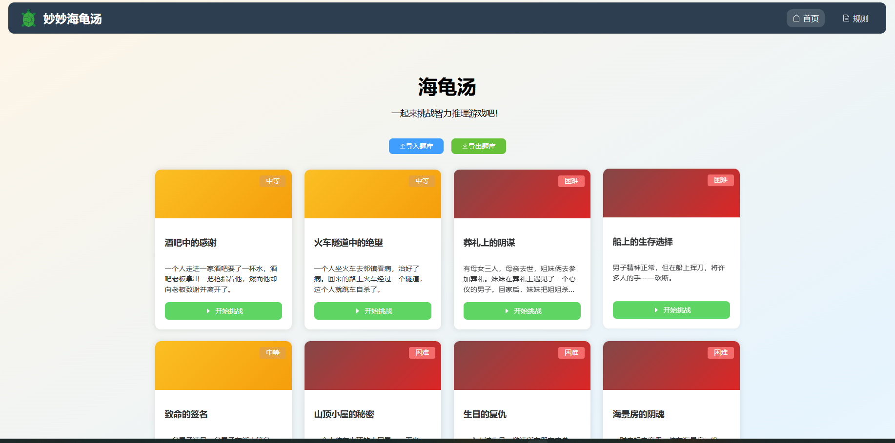
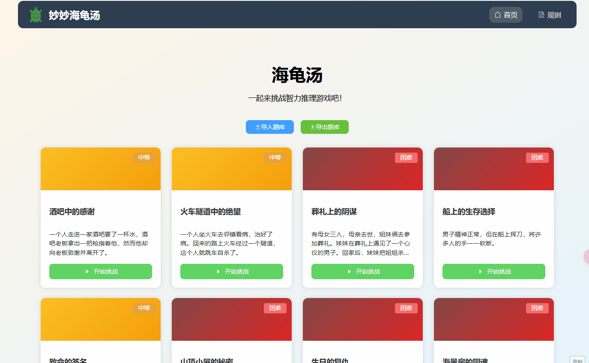

# 海龟汤 (Turtle Soup)

一个基于 Vue 3 + Vite 开发的海龟汤游戏。玩家通过提问来推理故事真相，体验解谜的乐趣。
## 展示

### 游戏界面

## 功能特点

- 📱 响应式设计，支持移动端和桌面端
- 🎮 多个谜题关卡
- 💬 AI 驱动的问答系统
- 🎯 难度分级系统
- 💾 支持导入导出题库

## 技术栈

- Vue 3
- Vite
- Element Plus
- Pinia
- Vue Router
- Axios


## 快速开始

### Docker 方式运行（推荐）

1. 确保已安装 Docker 和 docker-compose

2. 克隆项目并配置环境变量
```bash
git clone <repository-url>
cd turtle-soup
cp .env.example .env.local
### 配置自己的 Ark 密钥（在.env.local文件中）
```
3. 构建并启动容器
```bash
docker-compose up -d
```
4. 打开浏览器访问
```bash
http://localhost:9001
```